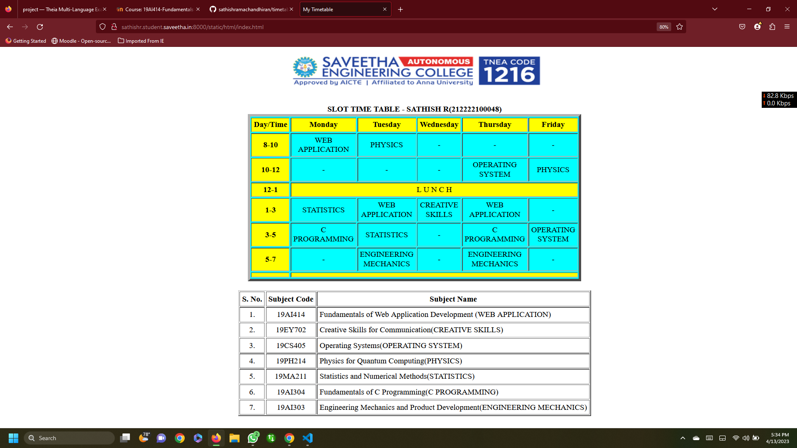

# Experiment_Time_Table

## AIM
To Write a html webpage page to display your timetable.

# ALGORITHM
### STEP 1
create a simple table using table tag
### STEP 2
Add header row using th tag
### STEP 3
Add your timetable
### STEP 4
Execute the program

# CODE
```
<!DOCTYPE html>
<html lang="en">
<head>
<title>My Timetable</title>
</head>
<body>
<center>

</center>
<br>
<table align="center" width="540" cellspacing="2" cellpadding="4" border="5" bgcolor="cyan">
<caption><b>SLOT TIME TABLE - SATHISH R(212222100048)</b></caption>
<tr align="center">
<th bgcolor="yellow">Day/Time</th>
<th bgcolor="yellow">Monday</th>
<th bgcolor="yellow">Tuesday</th>
<th bgcolor="yellow">Wednesday</th>
<th bgcolor="yellow">Thursday</th>
<th bgcolor="yellow">Friday</th>
</tr>
<tr align="center">
<th bgcolor="yellow">8-10</th>
<td>WEB APPLICATION</td>
<td>PHYSICS</td>
<td> - </td>
<td> - </td>
<td> - </td>
</tr>
<tr align="center">
<th bgcolor="yellow">10-12</th>
<td> - </td>
<td> - </td>
<td> - </td>
<td>OPERATING SYSTEM</td>
<td>PHYSICS</td>
</tr>
<tr>
<th bgcolor="yellow">12-1</th>
<td bgcolor="yellow" colspan="5" align="center">L U N C H</td>
</tr>
<tr align="center">
<th bgcolor="yellow">1-3</th>
<td>STATISTICS</td>
<td>WEB APPLICATION</td>
<td>CREATIVE SKILLS</td>
<td>WEB APPLICATION</td>
<td> - </td>
</tr>
<tr align="center">
<th bgcolor="yellow">3-5</th>
<td> C PROGRAMMING </td>
<td> STATISTICS</td>
<td> - </td>
<td>C PROGRAMMING</td>
<td>OPERATING SYSTEM</td>
</tr>
<tr align="center">
<th bgcolor="yellow">5-7</th>
<td> - </td>
<td> ENGINEERING MECHANICS </td>
<td>- </td>
<td>ENGINEERING MECHANICS</td>
<td>-</td>
</tr>
<tr>
<th bgcolor="yellow">   </th>
<td bgcolor="yellow" colspan="5" align="center">  </td>
</tr>
</table>
<br>
<table align="center" cellspacing="2" cellpadding="4" border="2">
<tr align="center">
<th>S. No.</th>
<th>Subject Code</th>
<th>Subject Name</th>
</tr>
<tr>
<td align="center">1.</td>
<td align="center">19AI414</td>
<td>Fundamentals of Web Application Development (WEB APPLICATION)</td>
</tr>
<tr>
<td align="center">2.</td>
<td align="center">19EY702</td>
<td>Creative Skills for Communication(CREATIVE SKILLS)</td>
</tr>
<tr>
<td align="center">3.</td>
<td align="center">19CS405</td>
<td>Operating Systems(OPERATING SYSTEM)</td>
</tr>
<tr>
<td align="center">4.</td>
<td align="center">19PH214</td>
<td>Physics for Quantum Computing(PHYSICS)</td>
</tr>
<tr>
<td align="center">5.</td>
<td align="center">19MA211</td>
<td>Statistics and Numerical Methods(STATISTICS)</td>
</tr>
<tr>
<td align="center">6.</td>
<td align="center">19AI304</td>
<td>Fundamentals of C Programming(C PROGRAMMING)</td>
</tr>
<tr>
<td align="center">7.</td>
<td align="center">19AI303</td>
<td>Engineering Mechanics and Product Development(ENGINEERING MECHANICS)</td>
</tr>
</table>
</body>
</html>
```
# OUTPUT


# RESULT :
Thus,the timetable is displayed and executed using HTML code.
